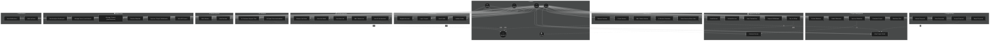

# Use Case Diagram — AI Tasker

```mermaid
%%{init: {"theme": "dark", "themeVariables": {"fontSize": "14px"}}}%%
graph TB
    subgraph ACTORS["👥 Actors"]
        GUEST(("👤\nGuest"))
        CLIENT(("🏢\nClient"))
        EXPERT(("👨‍💻\nExpert"))
        ADMIN(("⚙️\nAdmin"))
        AI(("🤖\nGemini AI"))
        STRIPE(("💳\nStripe"))
    end

    subgraph AUTH["🔐 Authentication"]
        UC1["Register Account"]
        UC2["Login / Logout"]
        UC3["View Profile"]
        UC4["Update Profile"]
    end

    subgraph JOB["📋 Job Management"]
        UC5["Browse Job Posts"]
        UC6["View Job Detail"]
        UC7["Post New Job"]
        UC8["Edit / Delete Job"]
        UC9["Use AI Job Assistant"]
    end

    subgraph PROPOSAL["📝 Proposal Flow"]
        UC10["Submit Proposal"]
        UC11["View Proposals"]
        UC12["Accept Proposal"]
        UC13["Reject Proposal"]
    end

    subgraph PROJECT["📁 Project Management"]
        UC14["View Project Detail"]
        UC15["Create Milestone"]
        UC16["Submit Milestone"]
        UC17["Approve Milestone"]
        UC18["Complete Project"]
        UC19["Real-time Chat"]
    end

    subgraph PAYMENT["💰 Payment & Escrow"]
        UC20["Fund Escrow"]
        UC21["Release Escrow"]
        UC22["Refund Escrow"]
        UC23["View Transactions"]
        UC24["Request Withdrawal"]
        UC25["Pay via Stripe"]
    end

    subgraph MARKET["🏪 Marketplace"]
        UC26["Browse Services"]
        UC27["Create Service"]
        UC28["Edit / Delete Service"]
        UC29["Order Service (Direct Hire)"]
        UC30["AI Service Generator"]
    end

    subgraph AI_FEAT["🤖 AI Features"]
        UC31["AI Expert Recommendation"]
        UC32["AI Customer Support Chat"]
    end

    subgraph REVIEW["⭐ Review System"]
        UC33["Write Review"]
        UC34["View Reviews"]
    end

    subgraph ADMIN_MOD["🛡️ Admin Panel"]
        UC35["View Analytics Dashboard"]
        UC36["Manage Users (Lock/Unlock)"]
        UC37["Manage Content (Jobs/Services)"]
        UC38["Resolve Disputes"]
        UC39["Approve / Reject Withdrawals"]
        UC40["View All Projects"]
    end

    subgraph NOTIF["🔔 Notifications"]
        UC41["View Notifications"]
        UC42["Mark as Read"]
    end

    %% GUEST
    GUEST --> UC1
    GUEST --> UC2
    GUEST --> UC5
    GUEST --> UC6
    GUEST --> UC26
    GUEST --> UC32

    %% CLIENT
    CLIENT --> UC2
    CLIENT --> UC3
    CLIENT --> UC4
    CLIENT --> UC7
    CLIENT --> UC8
    CLIENT --> UC9
    CLIENT --> UC11
    CLIENT --> UC12
    CLIENT --> UC13
    CLIENT --> UC14
    CLIENT --> UC15
    CLIENT --> UC17
    CLIENT --> UC18
    CLIENT --> UC19
    CLIENT --> UC20
    CLIENT --> UC21
    CLIENT --> UC22
    CLIENT --> UC23
    CLIENT --> UC25
    CLIENT --> UC26
    CLIENT --> UC29
    CLIENT --> UC31
    CLIENT --> UC33
    CLIENT --> UC34
    CLIENT --> UC41
    CLIENT --> UC42

    %% EXPERT
    EXPERT --> UC2
    EXPERT --> UC3
    EXPERT --> UC4
    EXPERT --> UC5
    EXPERT --> UC6
    EXPERT --> UC10
    EXPERT --> UC11
    EXPERT --> UC14
    EXPERT --> UC16
    EXPERT --> UC19
    EXPERT --> UC23
    EXPERT --> UC24
    EXPERT --> UC27
    EXPERT --> UC28
    EXPERT --> UC30
    EXPERT --> UC33
    EXPERT --> UC34
    EXPERT --> UC41
    EXPERT --> UC42

    %% ADMIN
    ADMIN --> UC2
    ADMIN --> UC35
    ADMIN --> UC36
    ADMIN --> UC37
    ADMIN --> UC38
    ADMIN --> UC39
    ADMIN --> UC40
    ADMIN --> UC41

    %% AI integrations
    UC9 -.->|"calls"| AI
    UC30 -.->|"calls"| AI
    UC31 -.->|"calls"| AI
    UC32 -.->|"calls"| AI

    %% Stripe integrations
    UC25 -.->|"calls"| STRIPE

    %% Include relationships
    UC12 -.->|"<<include>>"| UC14
    UC17 -.->|"<<include>>"| UC21
    UC29 -.->|"<<include>>"| UC14
```
