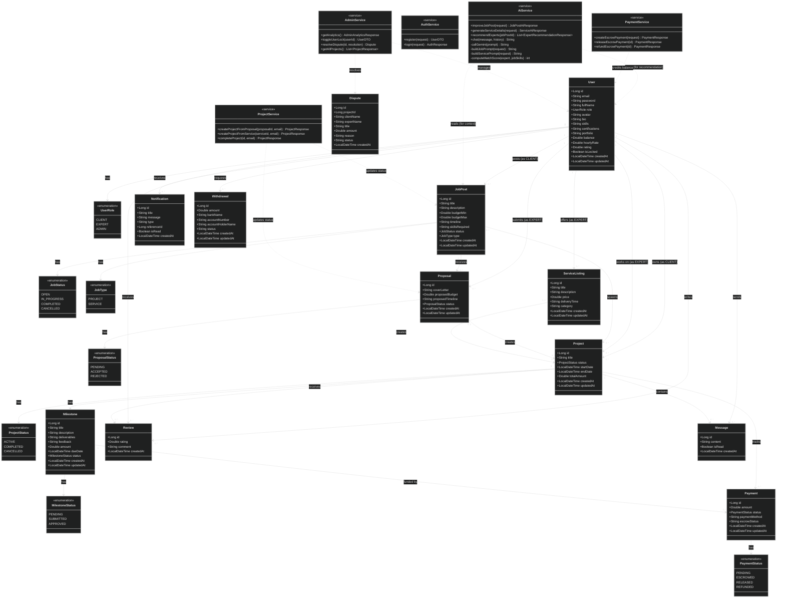

# Class Diagram — AI Tasker

```mermaid
%%{init: {"theme": "dark"}}%%
classDiagram
    direction TB

    %% ─── ENUMS ────────────────────────────────────────────────
    class UserRole {
        <<enumeration>>
        CLIENT
        EXPERT
        ADMIN
    }
    class JobStatus {
        <<enumeration>>
        OPEN
        IN_PROGRESS
        COMPLETED
        CANCELLED
    }
    class JobType {
        <<enumeration>>
        PROJECT
        SERVICE
    }
    class ProposalStatus {
        <<enumeration>>
        PENDING
        ACCEPTED
        REJECTED
    }
    class ProjectStatus {
        <<enumeration>>
        ACTIVE
        COMPLETED
        CANCELLED
    }
    class MilestoneStatus {
        <<enumeration>>
        PENDING
        SUBMITTED
        APPROVED
    }
    class PaymentStatus {
        <<enumeration>>
        PENDING
        ESCROWED
        RELEASED
        REFUNDED
    }

    %% ─── ENTITIES ─────────────────────────────────────────────
    class User {
        +Long id
        +String email
        +String password
        +String fullName
        +UserRole role
        +String avatar
        +String bio
        +String skills
        +String certifications
        +String portfolio
        +Double balance
        +Double hourlyRate
        +Double rating
        +Boolean isLocked
        +LocalDateTime createdAt
        +LocalDateTime updatedAt
    }

    class JobPost {
        +Long id
        +String title
        +String description
        +Double budgetMin
        +Double budgetMax
        +String timeline
        +String skillsRequired
        +JobStatus status
        +JobType type
        +LocalDateTime createdAt
        +LocalDateTime updatedAt
    }

    class Proposal {
        +Long id
        +String coverLetter
        +Double proposedBudget
        +String proposedTimeline
        +ProposalStatus status
        +LocalDateTime createdAt
        +LocalDateTime updatedAt
    }

    class Project {
        +Long id
        +String title
        +ProjectStatus status
        +LocalDateTime startDate
        +LocalDateTime endDate
        +Double totalAmount
        +LocalDateTime createdAt
        +LocalDateTime updatedAt
    }

    class Milestone {
        +Long id
        +String title
        +String description
        +String deliverables
        +String feedback
        +Double amount
        +LocalDateTime dueDate
        +MilestoneStatus status
        +LocalDateTime createdAt
        +LocalDateTime updatedAt
    }

    class Payment {
        +Long id
        +Double amount
        +PaymentStatus status
        +String paymentMethod
        +String escrowStatus
        +LocalDateTime createdAt
        +LocalDateTime updatedAt
    }

    class Review {
        +Long id
        +Double rating
        +String comment
        +LocalDateTime createdAt
    }

    class Message {
        +Long id
        +String content
        +Boolean isRead
        +LocalDateTime createdAt
    }

    class Notification {
        +Long id
        +String title
        +String message
        +String type
        +Long referenceId
        +Boolean isRead
        +LocalDateTime createdAt
    }

    class ServiceListing {
        +Long id
        +String title
        +String description
        +Double price
        +String deliveryTime
        +String category
        +LocalDateTime createdAt
        +LocalDateTime updatedAt
    }

    class Withdrawal {
        +Long id
        +Double amount
        +String bankName
        +String accountNumber
        +String accountHolderName
        +String status
        +LocalDateTime createdAt
        +LocalDateTime updatedAt
    }

    class Dispute {
        +Long id
        +Long projectId
        +String clientName
        +String expertName
        +String title
        +Double amount
        +String reason
        +String status
        +LocalDateTime createdAt
    }

    %% ─── SERVICES ─────────────────────────────────────────────
    class AiService {
        <<service>>
        +improveJobPost(request) JobPostAiResponse
        +generateServiceDetails(request) ServiceAiResponse
        +recommendExperts(jobPostId) List~ExpertRecommendationResponse~
        +chat(message, history) String
        -callGemini(prompt) String
        -buildJobPrompt(request) String
        -buildServicePrompt(request) String
        -computeMatchScore(expert, jobSkills) int
    }

    class AuthService {
        <<service>>
        +register(request) UserDTO
        +login(request) AuthResponse
    }

    class ProjectService {
        <<service>>
        +createProjectFromProposal(proposalId, email) ProjectResponse
        +createProjectFromService(serviceId, email) ProjectResponse
        +completeProject(id, email) ProjectResponse
    }

    class PaymentService {
        <<service>>
        +createEscrowPayment(request) PaymentResponse
        +releaseEscrowPayment(id) PaymentResponse
        +refundEscrowPayment(id) PaymentResponse
    }

    class AdminService {
        <<service>>
        +getAnalytics() AdminAnalyticsResponse
        +toggleUserLock(userId) UserDTO
        +resolveDispute(id, resolution) Dispute
        +getAllProjects() List~ProjectResponse~
    }

    %% ─── RELATIONSHIPS ────────────────────────────────────────
    User "1" --> "0..*" JobPost          : posts (as CLIENT)
    User "1" --> "0..*" Proposal         : submits (as EXPERT)
    User "1" --> "0..*" Project          : owns (as CLIENT)
    User "1" --> "0..*" Project          : works on (as EXPERT)
    User "1" --> "0..*" ServiceListing   : offers (as EXPERT)
    User "1" --> "0..*" Message          : sends
    User "1" --> "0..*" Notification     : receives
    User "1" --> "0..*" Review           : writes
    User "1" --> "0..*" Review           : receives
    User "1" --> "0..*" Withdrawal       : requests

    JobPost "1" --> "0..*" Proposal      : receives
    JobPost "0..1" --> "0..*" Project    : spawns

    Proposal "0..1" --> "0..1" Project   : creates

    ServiceListing "0..1" --> "0..*" Project : creates

    Project "1" --> "0..*" Milestone     : has
    Project "1" --> "0..*" Payment       : tracks
    Project "1" --> "0..*" Message       : contains
    Project "1" --> "0..*" Review        : receives

    Milestone "1" --> "0..*" Payment     : funded by

    User --> UserRole                    : has
    JobPost --> JobStatus                : has
    JobPost --> JobType                  : has
    Proposal --> ProposalStatus          : has
    Project --> ProjectStatus            : has
    Milestone --> MilestoneStatus        : has
    Payment --> PaymentStatus            : has

    AiService ..> User                   : reads (for recommendation)
    AiService ..> JobPost                : reads (for context)
    ProjectService ..> Proposal          : updates status
    ProjectService ..> JobPost           : updates status
    PaymentService ..> User              : credits balance
    AdminService ..> User                : manages
    AdminService ..> Dispute             : resolves
```
