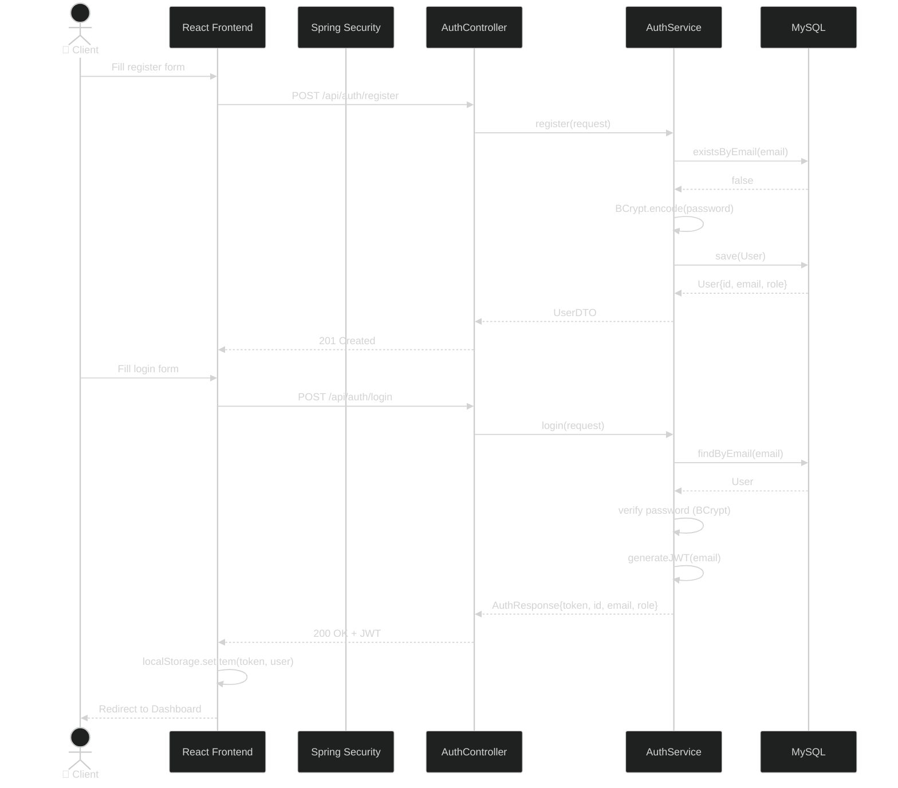
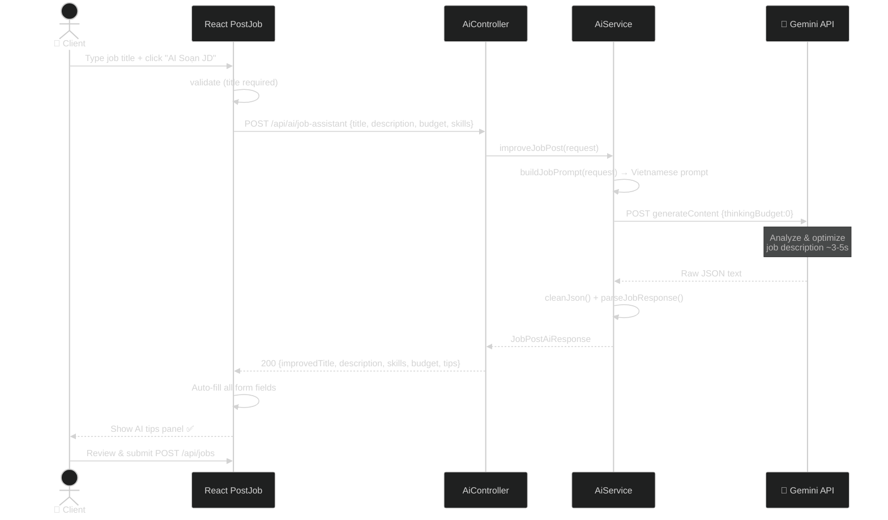
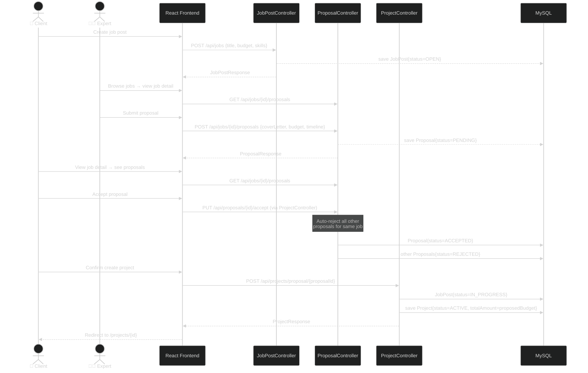
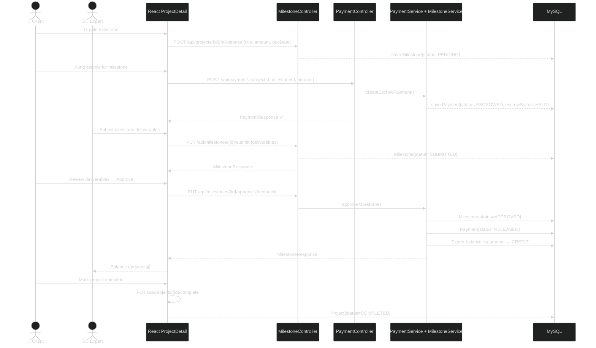
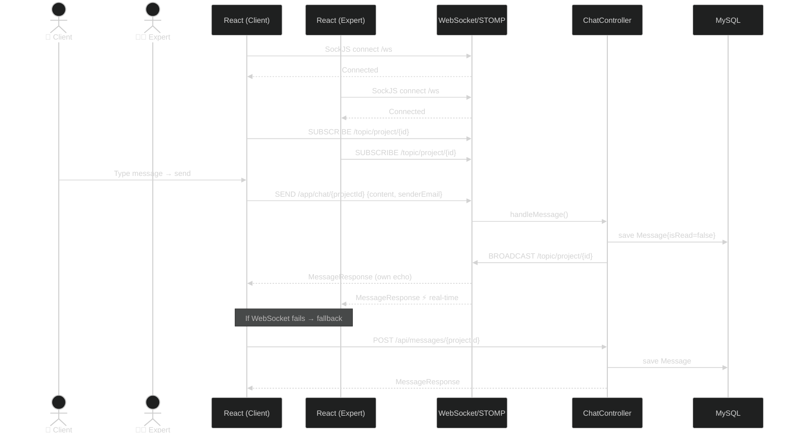
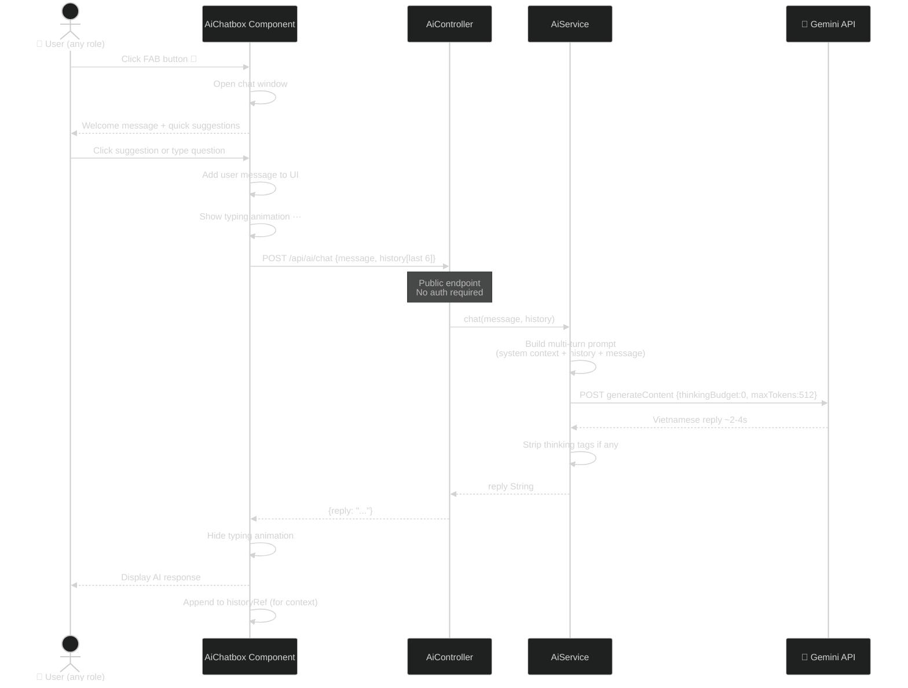

# Sequence Diagrams — AI Tasker

## 1. Authentication Flow

---

## 2. AI Job Assistant Flow

---

## 3. Job Post → Project Creation Flow

---

## 4. Milestone & Escrow Payment Flow

---

## 5. Real-time Chat (WebSocket) Flow

---

## 6. AI Chatbox Customer Support Flow

