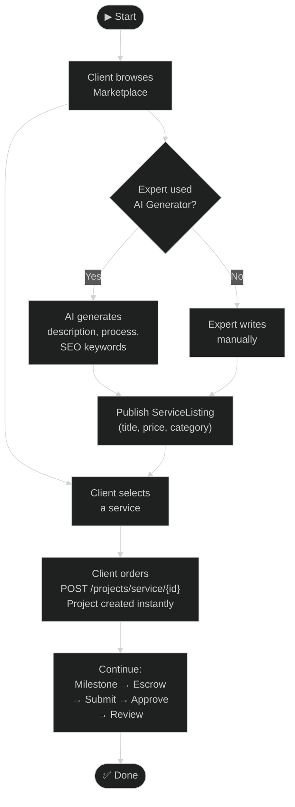
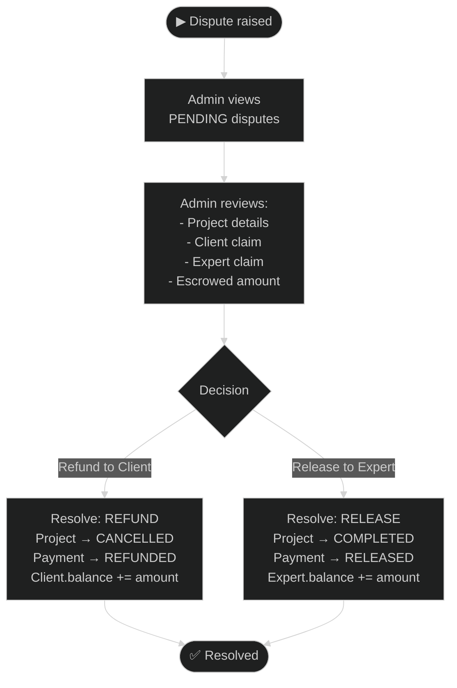
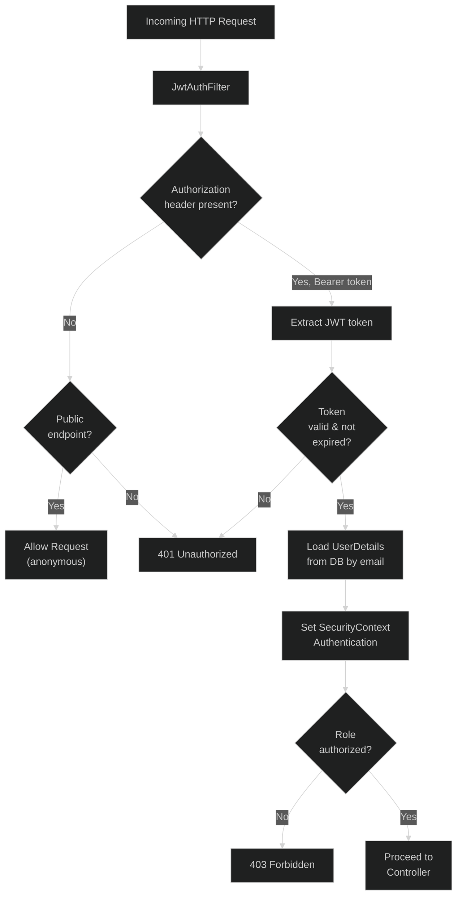

# Activity Diagrams — AI Tasker

## 1. Full Project Lifecycle

```mermaid
%%{init: {"theme": "dark"}}%%
flowchart TD
    START(["▶ Start"]) --> REG

    REG["Register Account\n(CLIENT or EXPERT)"]
    REG --> LOGIN["Login → JWT Token"]
    LOGIN --> ROLE{Role?}

    ROLE -->|CLIENT| C1["Post Job\n(title, budget, skills)"]
    ROLE -->|EXPERT| E1["Browse Job Board\nor Marketplace"]

    C1 --> AI_JOB{Use AI\nAssistant?}
    AI_JOB -->|Yes| AI_GEN["AI generates\nimproved JD + budget\n(Gemini API)"]
    AI_JOB -->|No| POST_JOB
    AI_GEN --> POST_JOB["Publish Job\nstatus = OPEN"]

    E1 --> VIEW_JOB["View Job Detail"]
    VIEW_JOB --> AI_REC["AI recommends\nbest-match experts\n(Client sees this)"]
    VIEW_JOB --> PROP["Submit Proposal\n(coverLetter, budget)"]
    PROP --> WAIT["Wait for\nClient Decision"]

    POST_JOB --> REVIEW_PROP["Review Proposals\n(all submitted experts)"]
    REVIEW_PROP --> DECIDE{Accept\nProposal?}
    DECIDE -->|No| REJECT_P["Reject Proposal\nstatus = REJECTED"]
    REJECT_P --> REVIEW_PROP
    DECIDE -->|Yes| ACCEPT_P["Accept Proposal\nAuto-reject others\nstatus = ACCEPTED"]

    ACCEPT_P --> CREATE_PROJ["Create Project\nstatus = ACTIVE\ntotalAmount set"]
    CREATE_PROJ --> CREATE_MS["Client creates\nMilestone\nstatus = PENDING"]

    CREATE_MS --> FUND{Fund\nEscrow?}
    FUND -->|Yes| ESCROW["Payment\nstatus = ESCROWED\n💰 Funds held"]
    FUND -->|Later| CREATE_MS

    ESCROW --> EXPERT_WORK["Expert works\non milestone"]
    EXPERT_WORK --> SUBMIT_MS["Expert submits\ndeliverables\nstatus = SUBMITTED"]

    SUBMIT_MS --> REVIEW_MS{Client\nReviews}
    REVIEW_MS -->|Revise| EXPERT_WORK
    REVIEW_MS -->|Approve| APPROVE_MS["Approve Milestone\nstatus = APPROVED"]

    APPROVE_MS --> RELEASE["Release Escrow\nPayment RELEASED\nExpert.balance += amount"]

    RELEASE --> MORE_MS{More\nMilestones?}
    MORE_MS -->|Yes| CREATE_MS
    MORE_MS -->|No| COMPLETE["Mark Project\nCOMPLETED"]

    COMPLETE --> REVIEW_A["Both parties\nwrite Reviews\n(1-5 stars)"]
    REVIEW_A --> RATING["System recalculates\nUser.rating (avg)"]

    RATING --> WITHDRAW{Expert\nwithdraw?}
    WITHDRAW -->|Yes| WD_REQ["Create Withdrawal\nRequest\nstatus = PENDING"]
    WD_REQ --> ADMIN_WD["Admin reviews\nApprove / Reject"]
    ADMIN_WD --> WITHDRAW
    WITHDRAW -->|Done| END_OK(["✅ Done"])
```

---

## 2. Marketplace (Direct Service Order) Flow

---

## 3. Admin Dispute Resolution Flow

---

## 4. Authentication & JWT Validation Flow

