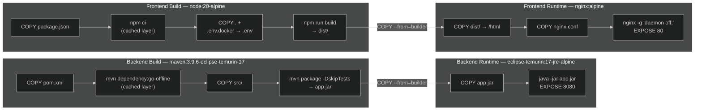
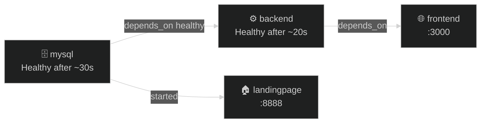

# Deployment Diagram — AI Tasker

## Docker Compose Deployment

```mermaid
%%{init: {"theme": "dark"}}%%
graph TB
    subgraph HOST["🖥️ Host Machine (Windows / Linux)"]

        subgraph DOCKER["🐳 Docker Network: altasker_default"]

            subgraph FE_C["📦 aitasker-frontend\naltasker-frontend:latest"]
                FE_IMG["nginx:alpine\nPort 80 (internal)"]
                REACT["React 19 + Vite SPA\n/usr/share/nginx/html"]
                NGINX_CFG["nginx.conf\n/api/* → backend:8080\n/ws/* → backend:8080"]
            end

            subgraph BE_C["📦 aitasker-backend\naltasker-backend:latest"]
                JVM["eclipse-temurin:17-jre-alpine\nPort 8080"]
                SPRING["Spring Boot 3.3\nJWT Auth + Security"]
                WS["WebSocket STOMP\n/ws endpoint"]
                REST["REST API\n/api/**"]
            end

            subgraph DB_C["📦 aitasker-mysql\nmysql:8.0"]
                MYSQL["MySQL 8.0\nPort 3306 (internal)"]
                SCHEMA["aitasker_db\n13 tables"]
                VOL[("💾 mysql_data\nDocker Volume")]
            end

            subgraph LAND_C["📦 aitasker-landing\naltasker-landingpage:latest"]
                NGINX_L["nginx:alpine\nStatic HTML/CSS/JS"]
            end
        end

        PORT_3000["🌐 localhost:3000\n(Frontend)"]
        PORT_8080["⚙️ localhost:8080\n(Backend API)"]
        PORT_3306["🗄️ localhost:3306\n(MySQL)"]
        PORT_8888["🏠 localhost:8888\n(Landing Page)"]
    end

    subgraph EXTERNAL["☁️ External Services"]
        GEMINI["🤖 Google Gemini API\ngenerativelanguage.googleapis.com\ngemini-2.5-flash"]
        STRIPE["💳 Stripe API\napi.stripe.com\nPayment Processing"]
        SMTP["📧 Gmail SMTP\nsmtp.gmail.com:587\nEmail Notifications"]
    end

    subgraph BROWSER["🌐 User's Browser"]
        USER["👤 User"]
        BROWSER_APP["React SPA\nCSS + JS"]
        SOCKJS["SockJS Client\nWebSocket"]
    end

    %% Port mappings
    PORT_3000 -->|"maps to :80"| FE_C
    PORT_8080 -->|"maps to :8080"| BE_C
    PORT_3306 -->|"maps to :3306"| DB_C
    PORT_8888 -->|"maps to :80"| LAND_C

    %% User access
    USER -->|"HTTP"| PORT_3000
    USER -->|"HTTP"| PORT_8888
    USER -.->|"direct API (dev)"| PORT_8080

    %% Frontend → Backend (via Nginx proxy)
    BROWSER_APP -->|"GET/POST /api/*\nproxied by nginx"| PORT_3000
    SOCKJS -->|"WS /ws/*\nproxied by nginx"| PORT_3000

    %% Nginx → Backend
    NGINX_CFG -->|"http://backend:8080"| BE_C

    %% Backend → DB
    SPRING -->|"JDBC\nMySQL Connector/J"| MYSQL
    MYSQL --- VOL

    %% Backend → External
    SPRING -->|"HTTPS REST"| GEMINI
    SPRING -->|"HTTPS REST"| STRIPE
    SPRING -->|"STARTTLS :587"| SMTP

    %% Healthchecks
    BE_C -.->|"healthcheck\n/actuator/health"| BE_C
    DB_C -.->|"healthcheck\nmysqladmin ping"| DB_C

    style HOST fill:#0d0d1a,stroke:#00f0ff,stroke-width:2px
    style DOCKER fill:#05050f,stroke:#b026ff,stroke-width:1px
    style EXTERNAL fill:#050a05,stroke:#39ff14,stroke-width:1px
    style BROWSER fill:#0a0505,stroke:#ffcf00,stroke-width:1px
```

---

## Build Pipeline (Multi-Stage Docker)

```mermaid
%%{init: {"theme": "dark"}}%%
flowchart LR
    subgraph BACKEND_BUILD["Backend Build — maven:3.9.6-eclipse-temurin-17"]
        B1["COPY pom.xml"] --> B2["mvn dependency:go-offline\n(cached layer)"]
        B2 --> B3["COPY src/"]
        B3 --> B4["mvn package -DskipTests\n→ app.jar"]
    end

    subgraph BACKEND_RUN["Backend Runtime — eclipse-temurin:17-jre-alpine"]
        B5["COPY app.jar"] --> B6["java -jar app.jar\nEXPOSE 8080"]
    end

    subgraph FRONTEND_BUILD["Frontend Build — node:20-alpine"]
        F1["COPY package.json"] --> F2["npm ci\n(cached layer)"]
        F2 --> F3["COPY . +\n.env.docker → .env"]
        F3 --> F4["npm run build\n→ dist/"]
    end

    subgraph FRONTEND_RUN["Frontend Runtime — nginx:alpine"]
        F5["COPY dist/ → /html"] --> F6["COPY nginx.conf"]
        F6 --> F7["nginx -g 'daemon off;'\nEXPOSE 80"]
    end

    B4 -->|"COPY --from=builder"| B5
    F4 -->|"COPY --from=builder"| F5
```

---

## Container Dependencies (Startup Order)

```mermaid
%%{init: {"theme": "dark"}}%%
flowchart LR
    MYSQL["🗄️ mysql\nHealthy after ~30s"] -->|"depends_on healthy"| BACKEND
    BACKEND["⚙️ backend\nHealthy after ~20s"] -->|"depends_on"| FRONTEND
    MYSQL -->|"started"| LANDING
    FRONTEND["🌐 frontend\n:3000"]
    LANDING["🏠 landingpage\n:8888"]
```
