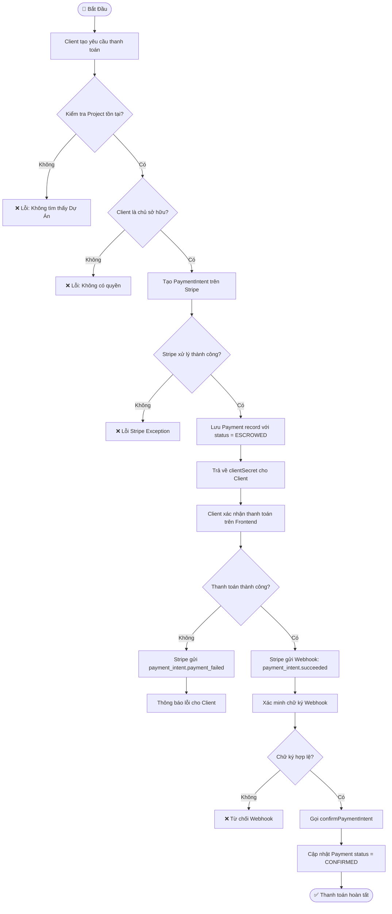
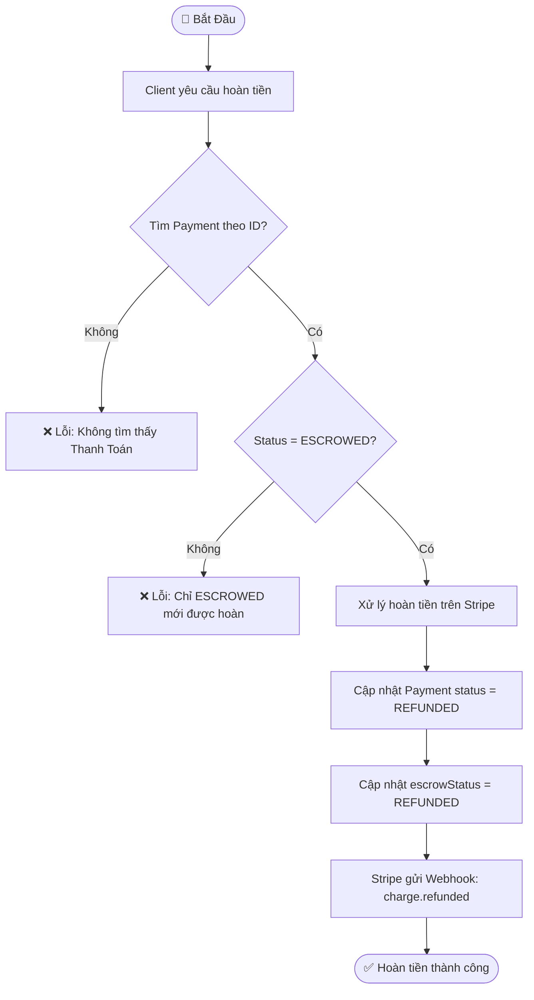
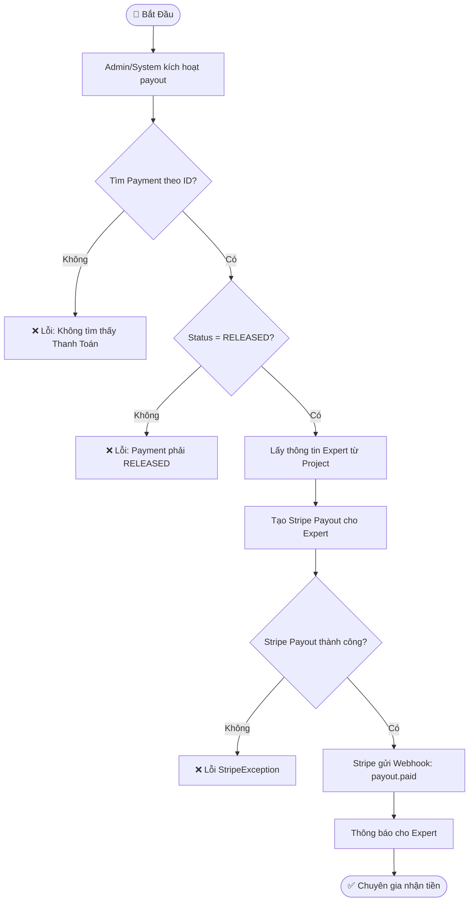
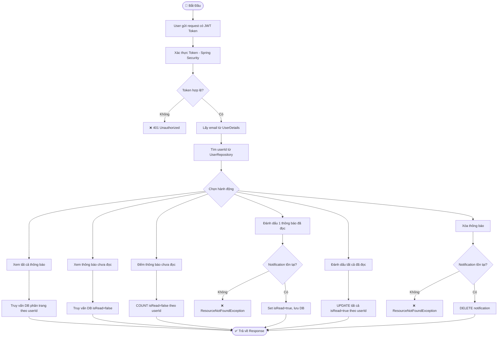

# Activity Diagram – AITasker

## 1. Quy trình Thanh Toán Escrow (Payment Flow)

## 2. Quy trình Hoàn Tiền (Refund Flow)

## 3. Quy trình Thanh Toán Chuyên Gia (Expert Payout Flow)

## 4. Quy trình Quản Lý Thông Báo (Notification Flow)

