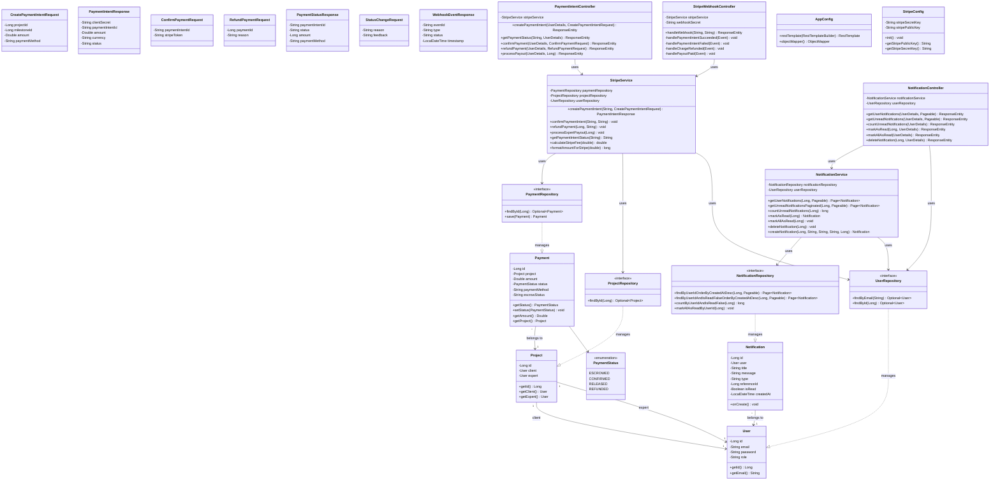

# Class Diagram – AITasker

```mermaid
classDiagram
    %% ===== ENTITY =====
    class Notification {
        -Long id
        -User user
        -String title
        -String message
        -String type
        -Long referenceId
        -Boolean isRead
        -LocalDateTime createdAt
        +onCreate() void
    }

    class User {
        -Long id
        -String email
        -String password
        -String role
        +getId() Long
        +getEmail() String
    }

    class Project {
        -Long id
        -User client
        -User expert
        +getId() Long
        +getClient() User
        +getExpert() User
    }

    class Payment {
        -Long id
        -Project project
        -Double amount
        -PaymentStatus status
        -String paymentMethod
        -String escrowStatus
        +getStatus() PaymentStatus
        +setStatus(PaymentStatus) void
        +getAmount() Double
        +getProject() Project
    }

    class PaymentStatus {
        <<enumeration>>
        ESCROWED
        CONFIRMED
        RELEASED
        REFUNDED
    }

    %% ===== DTOs =====
    class CreatePaymentIntentRequest {
        -Long projectId
        -Long milestoneId
        -Double amount
        -String paymentMethod
    }

    class PaymentIntentResponse {
        -String clientSecret
        -String paymentIntentId
        -Double amount
        -String currency
        -String status
    }

    class ConfirmPaymentRequest {
        -String paymentIntentId
        -String stripeToken
    }

    class RefundPaymentRequest {
        -Long paymentId
        -String reason
    }

    class PaymentStatusResponse {
        -String paymentIntentId
        -String status
        -Long amount
        -String paymentMethod
    }

    class StatusChangeRequest {
        -String reason
        -String feedback
    }

    class WebhookEventResponse {
        -String eventId
        -String type
        -String status
        -LocalDateTime timestamp
    }

    %% ===== REPOSITORIES =====
    class NotificationRepository {
        <<interface>>
        +findByUserIdOrderByCreatedAtDesc(Long, Pageable) Page~Notification~
        +findByUserIdAndIsReadFalseOrderByCreatedAtDesc(Long, Pageable) Page~Notification~
        +countByUserIdAndIsReadFalse(Long) long
        +markAllAsReadByUserId(Long) void
    }

    class UserRepository {
        <<interface>>
        +findByEmail(String) Optional~User~
        +findById(Long) Optional~User~
    }

    class PaymentRepository {
        <<interface>>
        +findById(Long) Optional~Payment~
        +save(Payment) Payment
    }

    class ProjectRepository {
        <<interface>>
        +findById(Long) Optional~Project~
    }

    %% ===== SERVICES =====
    class NotificationService {
        -NotificationRepository notificationRepository
        -UserRepository userRepository
        +getUserNotifications(Long, Pageable) Page~Notification~
        +getUnreadNotificationsPaginated(Long, Pageable) Page~Notification~
        +countUnreadNotifications(Long) long
        +markAsRead(Long) Notification
        +markAllAsRead(Long) void
        +deleteNotification(Long) void
        +createNotification(Long, String, String, String, Long) Notification
    }

    class StripeService {
        -PaymentRepository paymentRepository
        -ProjectRepository projectRepository
        -UserRepository userRepository
        +createPaymentIntent(String, CreatePaymentIntentRequest) PaymentIntentResponse
        +confirmPaymentIntent(String, String) void
        +refundPayment(Long, String) void
        +processExpertPayout(Long) void
        +getPaymentIntentStatus(String) String
        +calculateStripeFee(double) double
        +formatAmountForStripe(double) long
    }

    %% ===== CONTROLLERS =====
    class NotificationController {
        -NotificationService notificationService
        -UserRepository userRepository
        +getUserNotifications(UserDetails, Pageable) ResponseEntity
        +getUnreadNotifications(UserDetails, Pageable) ResponseEntity
        +countUnreadNotifications(UserDetails) ResponseEntity
        +markAsRead(Long, UserDetails) ResponseEntity
        +markAllAsRead(UserDetails) ResponseEntity
        +deleteNotification(Long, UserDetails) ResponseEntity
    }

    class PaymentIntentController {
        -StripeService stripeService
        +createPaymentIntent(UserDetails, CreatePaymentIntentRequest) ResponseEntity
        +getPaymentStatus(String, UserDetails) ResponseEntity
        +confirmPayment(UserDetails, ConfirmPaymentRequest) ResponseEntity
        +refundPayment(UserDetails, RefundPaymentRequest) ResponseEntity
        +processPayout(UserDetails, Long) ResponseEntity
    }

    class StripeWebhookController {
        -StripeService stripeService
        -String webhookSecret
        +handleWebhook(String, String) ResponseEntity
        -handlePaymentIntentSucceeded(Event) void
        -handlePaymentIntentFailed(Event) void
        -handleChargeRefunded(Event) void
        -handlePayoutPaid(Event) void
    }

    %% ===== CONFIGS =====
    class AppConfig {
        +restTemplate(RestTemplateBuilder) RestTemplate
        +objectMapper() ObjectMapper
    }

    class StripeConfig {
        -String stripeSecretKey
        -String stripePublicKey
        +init() void
        +getStripePublicKey() String
        +getStripeSecretKey() String
    }

    %% ===== RELATIONSHIPS =====
    Notification "*" --> "1" User : belongs to
    Payment "*" --> "1" Project : belongs to
    Project "1" --> "1" User : client
    Project "1" --> "1" User : expert
    Payment --> PaymentStatus

    NotificationController --> NotificationService : uses
    NotificationController --> UserRepository : uses
    NotificationService --> NotificationRepository : uses
    NotificationService --> UserRepository : uses

    PaymentIntentController --> StripeService : uses
    StripeWebhookController --> StripeService : uses
    StripeService --> PaymentRepository : uses
    StripeService --> ProjectRepository : uses
    StripeService --> UserRepository : uses

    NotificationRepository ..|> Notification : manages
    PaymentRepository ..|> Payment : manages
    ProjectRepository ..|> Project : manages
    UserRepository ..|> User : manages
```
