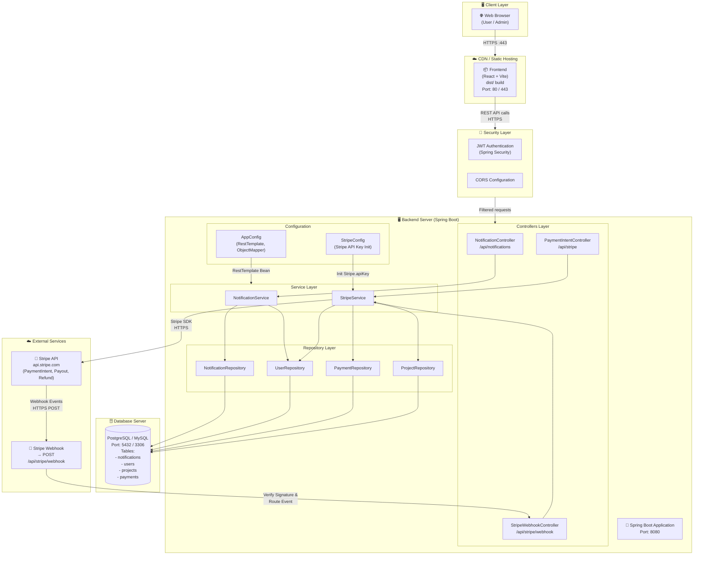
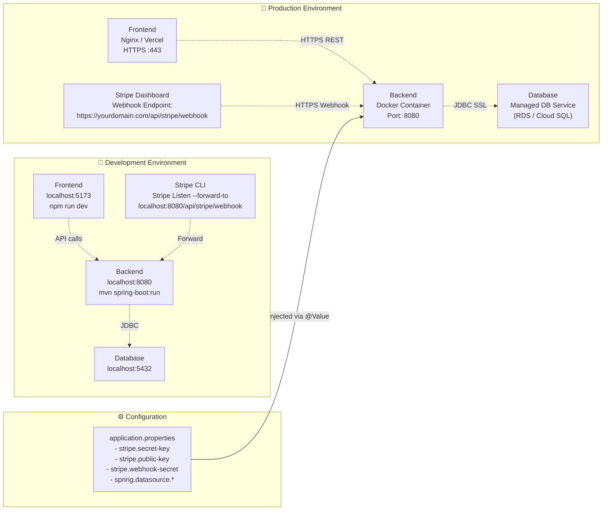

# Deployment Diagram – AITasker

```mermaid
graph TB
    subgraph Client_Layer ["🖥️ Client Layer"]
        Browser["🌐 Web Browser\n(User / Admin)"]
    end

    subgraph CDN ["☁️ CDN / Static Hosting"]
        FE["📦 Frontend\n(React + Vite)\ndist/ build\nPort: 80 / 443"]
    end

    subgraph Backend_Server ["🖥️ Backend Server (Spring Boot)"]
        direction TB
        API["🍃 Spring Boot Application\nPort: 8080"]

        subgraph Controllers ["Controllers Layer"]
            NC["NotificationController\n/api/notifications"]
            PIC["PaymentIntentController\n/api/stripe"]
            SWC["StripeWebhookController\n/api/stripe/webhook"]
        end

        subgraph Services ["Service Layer"]
            NSvc["NotificationService"]
            SSvc["StripeService"]
        end

        subgraph Config ["Configuration"]
            AC["AppConfig\n(RestTemplate, ObjectMapper)"]
            SC["StripeConfig\n(Stripe API Key Init)"]
        end

        subgraph Repositories ["Repository Layer"]
            NRepo["NotificationRepository"]
            URepo["UserRepository"]
            PRepo["PaymentRepository"]
            ProjRepo["ProjectRepository"]
        end
    end

    subgraph Database ["🗄️ Database Server"]
        DB[("PostgreSQL / MySQL\nPort: 5432 / 3306\nTables:\n- notifications\n- users\n- projects\n- payments")]
    end

    subgraph External_Services ["☁️ External Services"]
        StripeAPI["🔵 Stripe API\napi.stripe.com\n(PaymentIntent, Payout, Refund)"]
        StripeWebhook["🔔 Stripe Webhook\n→ POST /api/stripe/webhook"]
    end

    subgraph Security ["🔐 Security Layer"]
        JWT["JWT Authentication\n(Spring Security)"]
        CORS["CORS Configuration"]
    end

    %% Connections
    Browser -->|"HTTPS :443"| CDN
    FE -->|"REST API calls\nHTTPS"| Security

    Security -->|"Filtered requests"| Controllers

    NC --> NSvc
    PIC --> SSvc
    SWC --> SSvc

    NSvc --> NRepo
    NSvc --> URepo
    SSvc --> PRepo
    SSvc --> ProjRepo
    SSvc --> URepo

    NRepo --> DB
    URepo --> DB
    PRepo --> DB
    ProjRepo --> DB

    SSvc -->|"Stripe SDK\nHTTPS"| StripeAPI
    StripeAPI -->|"Webhook Events\nHTTPS POST"| StripeWebhook
    StripeWebhook -->|"Verify Signature &\nRoute Event"| SWC

    SC -->|"Init Stripe.apiKey"| SSvc
    AC -->|"RestTemplate Bean"| Services
```

## Chi Tiết Deployment Nodes

```mermaid
graph LR
    subgraph Dev_Env ["🔧 Development Environment"]
        Dev_FE["Frontend\nlocalhost:5173\nnpm run dev"]
        Dev_BE["Backend\nlocalhost:8080\nmvn spring-boot:run"]
        Dev_DB["Database\nlocalhost:5432"]
        Dev_Stripe["Stripe CLI\nStripe Listen --forward-to\nlocalhost:8080/api/stripe/webhook"]
    end

    subgraph Prod_Env ["🚀 Production Environment"]
        Prod_FE["Frontend\nNginx / Vercel\nHTTPS :443"]
        Prod_BE["Backend\nDocker Container\nPort: 8080"]
        Prod_DB["Database\nManaged DB Service\n(RDS / Cloud SQL)"]
        Prod_Stripe["Stripe Dashboard\nWebhook Endpoint:\nhttps://yourdomain.com/api/stripe/webhook"]
    end

    subgraph Config_Files ["⚙️ Configuration"]
        Props["application.properties\n- stripe.secret-key\n- stripe.public-key\n- stripe.webhook-secret\n- spring.datasource.*"]
    end

    Dev_FE -.->|"API calls"| Dev_BE
    Dev_BE -.->|"JDBC"| Dev_DB
    Dev_Stripe -.->|"Forward"| Dev_BE

    Prod_FE -.->|"HTTPS REST"| Prod_BE
    Prod_BE -.->|"JDBC SSL"| Prod_DB
    Prod_Stripe -.->|"HTTPS Webhook"| Prod_BE

    Props -->|"Injected via @Value"| Prod_BE
```
