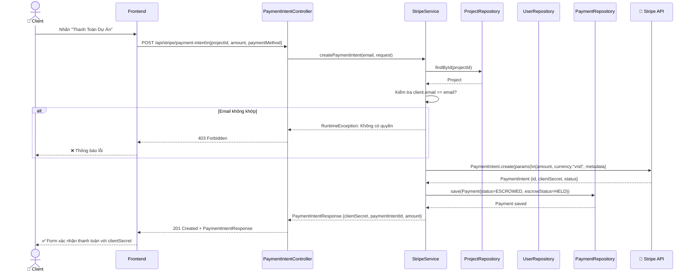
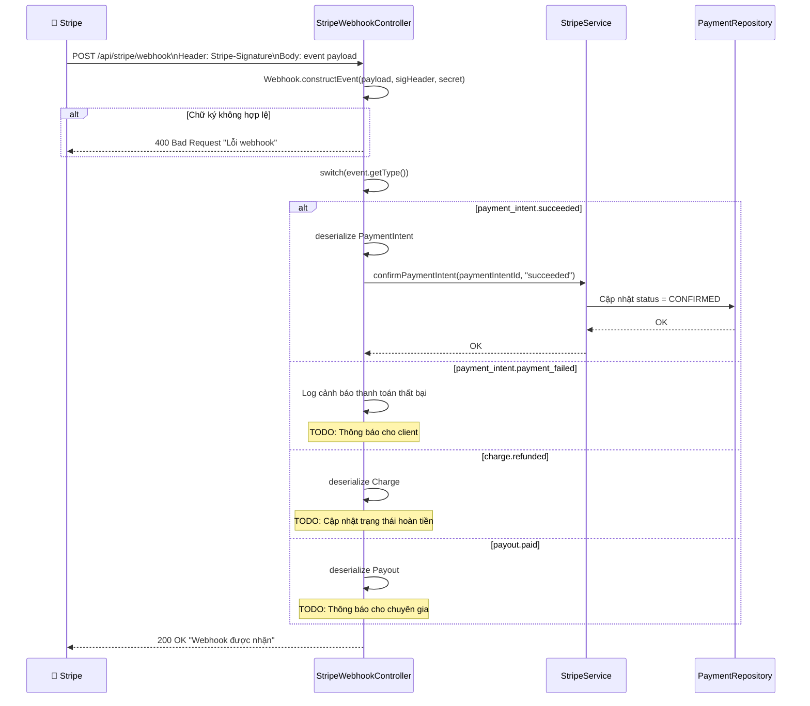
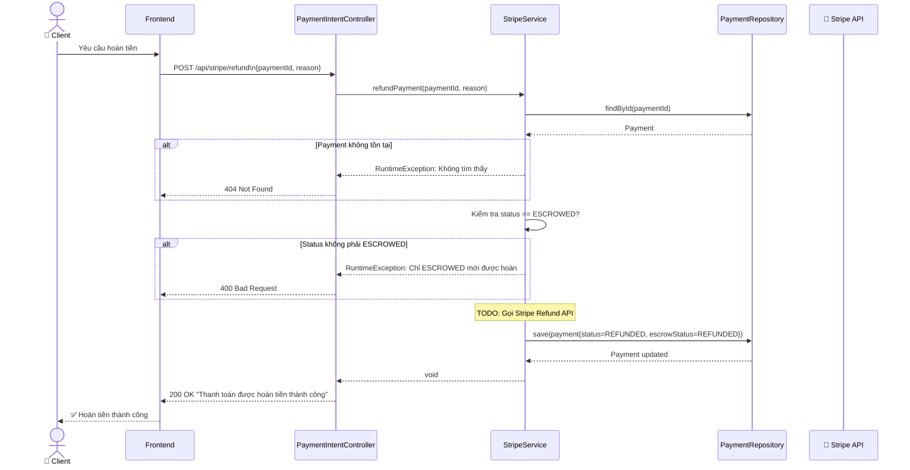
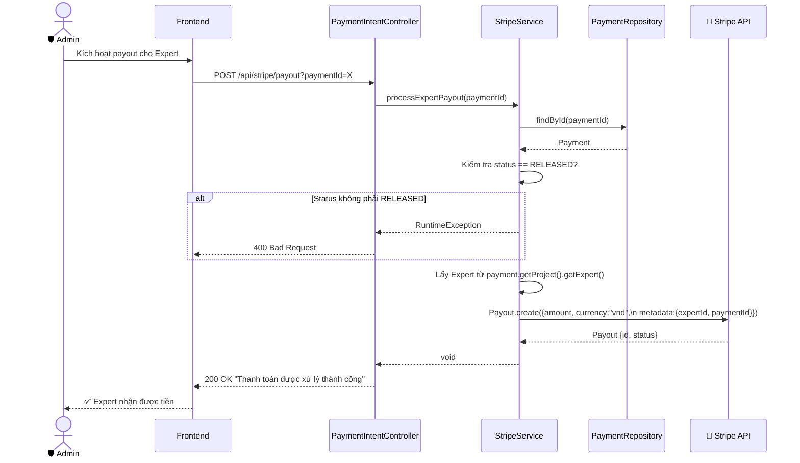
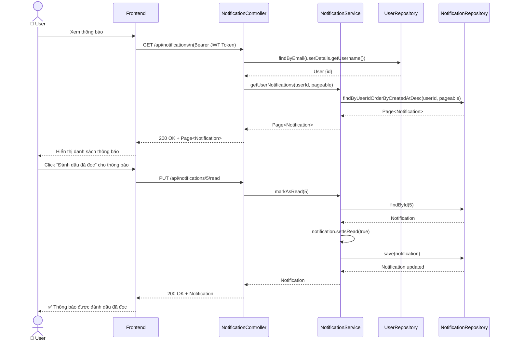

# Sequence Diagram – AITasker

## 1. Tạo Payment Intent (Create Payment Intent)

## 2. Xử Lý Stripe Webhook (Webhook Handling)

## 3. Hoàn Tiền (Refund Payment)

## 4. Thanh Toán Chuyên Gia (Expert Payout)

## 5. Quản Lý Thông Báo (Notification Management)

