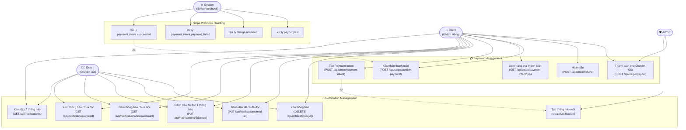

# Use Case Diagram – AITasker

```mermaid
flowchart TD
    %% Actors
    Client(["👤 Client\n(Khách Hàng)"])
    Expert(["👨‍💼 Expert\n(Chuyên Gia)"])
    System(["⚙️ System\n(Stripe Webhook)"])
    Admin(["🛡️ Admin"])

    %% Notification Use Cases
    subgraph UC_Notification ["📢 Notification Management"]
        UC1["Xem tất cả thông báo\n(GET /api/notifications)"]
        UC2["Xem thông báo chưa đọc\n(GET /api/notifications/unread)"]
        UC3["Đếm thông báo chưa đọc\n(GET /api/notifications/unread/count)"]
        UC4["Đánh dấu đã đọc 1 thông báo\n(PUT /api/notifications/{id}/read)"]
        UC5["Đánh dấu tất cả đã đọc\n(PUT /api/notifications/read-all)"]
        UC6["Xóa thông báo\n(DELETE /api/notifications/{id})"]
        UC7["Tạo thông báo mới\n(createNotification)"]
    end

    %% Payment Use Cases
    subgraph UC_Payment ["💳 Payment Management"]
        UC8["Tạo Payment Intent\n(POST /api/stripe/payment-intent)"]
        UC9["Xem trạng thái thanh toán\n(GET /api/stripe/payment-intent/{id})"]
        UC10["Xác nhận thanh toán\n(POST /api/stripe/confirm-payment)"]
        UC11["Hoàn tiền\n(POST /api/stripe/refund)"]
        UC12["Thanh toán cho Chuyên Gia\n(POST /api/stripe/payout)"]
    end

    %% Webhook Use Cases
    subgraph UC_Webhook ["🔗 Stripe Webhook Handling"]
        UC13["Xử lý payment_intent.succeeded"]
        UC14["Xử lý payment_intent.payment_failed"]
        UC15["Xử lý charge.refunded"]
        UC16["Xử lý payout.paid"]
    end

    %% Client relationships
    Client --> UC1
    Client --> UC2
    Client --> UC3
    Client --> UC4
    Client --> UC5
    Client --> UC6
    Client --> UC8
    Client --> UC9
    Client --> UC10
    Client --> UC11
    Client --> UC12

    %% Expert relationships
    Expert --> UC1
    Expert --> UC2
    Expert --> UC3
    Expert --> UC4
    Expert --> UC5
    Expert --> UC6

    %% Admin relationships
    Admin --> UC7
    Admin --> UC12

    %% System/Webhook relationships
    System --> UC13
    System --> UC14
    System --> UC15
    System --> UC16

    %% Include relationships
    UC13 -.->|"<<include>>"| UC10
    UC8 -.->|"<<include>>"| UC7
```
